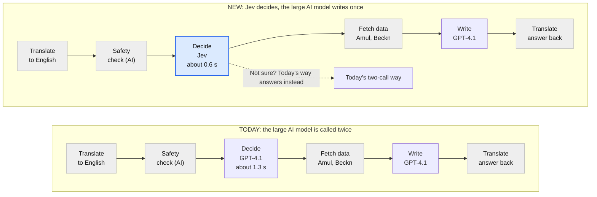

# How Jev speeds up the Amul farmer assistant

Sep 30, 2026 · Karthik Naig

A plain-language guide for non-technical readers. The technical design is in
[JEV_PLANNER.md](JEV_PLANNER.md); the list of code changes is in
[CHANGES_VS_UPSTREAM.md](CHANGES_VS_UPSTREAM.md).

## The short version

Jev replaces the slowest thinking step of the assistant with a fast multiple-choice step, saving about half a second per question. Today the assistant asks a large AI model (GPT-4.1) twice for every farmer question: once to decide what information to look up, and once to write the answer. With Jev, a small specialised model called Jev answers a set of multiple-choice questions about the farmer's message instead of the first call. Ordinary code turns those answers into the lookups. The large model is then asked only once, to write the answer.

The new way is off by default and runs side by side with today's way in a test screen (the lab). When Jev is not sure, the system falls back to today's way, so a hard question is never answered worse than today.

## What happens today when a farmer asks a question

Today every question goes through the large AI model twice, and the first pass is pure decision-making. Think of a clerk at a dairy office who reads the farmer's question, walks to the cabinets to pull the right files, then reads the files and writes a reply. The clerk is careful but reads the full rulebook (about 9,000 words of instructions and 12 tool descriptions) before every step.

1. **Translate** the farmer's Gujarati, Hindi, Marathi, Bengali or Punjabi into English.
2. **Safety check:** is this a farming, dairy or livestock question?
3. **First AI call (decide):** the model reads the rulebook and the question and decides what to look up: vet advice documents, mandi prices, weather, the farmer's milk records, a vet booking, and so on.
4. **Look up the data** from Amul, Beckn and government systems.
5. **Second AI call (write):** the model reads the rulebook again, plus the data, and writes the English answer.
6. **Translate the answer** back to the farmer's language.

Step 3 takes about 1 second on a typical question and up to 2 seconds on a slow one. Occasionally the model loops and repeats a lookup many times.

## What changes with Jev

Only the first AI call is replaced; every other step stays exactly as it is today.

Grey steps are identical in both ways and are not counted in the saving; times are lab medians.

Instead of the large model reading the full rulebook to decide, Jev answers multiple-choice questions about the message, and code turns the answers into lookups. The large model is called once, to write the answer from the results. Jev can also do the safety check inside the same request, which removes one more AI call.

## The questions Jev answers

Jev never writes text: it only picks from options we give it, and says how sure it is. In one request of about 0.6 seconds it answers around 25 questions about the farmer's message at once. It also gets the last few messages of the conversation and a short farmer profile (district, dairy accounts, technicians).

| Question Jev answers | Options it picks from | What the system does with the answer |
| --- | --- | --- |
| What does the farmer want? | 14 topics: animal health, feeding, breeding, crops, schemes, market price, weather, loan, greeting, off-topic... | Chooses which lookup to run |
| Which action comes first? | Search vet documents, book a vet visit, book insemination, milk records, bonus, mandi price, weather, schemes, soil card, no lookup | The main lookup |
| Is the farmer asking for a vet visit? | Asks to book, agrees to an earlier offer, only describes symptoms, declines, not about a visit | Book, offer a visit, or give advice only |
| Cow or buffalo? | Cow, buffalo, not stated | Filled into the booking, or the assistant asks |
| Which crop, which district, which dates? | Lists from Amul and Agmarknet (199 crops, 33 districts, date periods) | Filled into the mandi or weather lookup |
| Did the last assistant message offer something, and did the farmer say yes? | Yes / no with a probability | Carries a booking or loan over two messages |
| Is the question safe and in scope? | Farming, or one of 8 reasons to decline | Answers, or replies with a fixed polite decline |

Each answer comes with a confidence between 0 and 1. Plain code, written from the same rulebook the AI model follows, turns the answers into lookups. For example: "a sick animal, farmer did not ask for a visit" means search vet advice, then offer a health call at the end.

## Safety nets

Every way Jev can go wrong falls back to today's behaviour, and nothing irreversible happens on Jev's word alone.

- **When Jev is unsure.** Every decision must clear a confidence bar (0.45 by default). If the weakest decision in a plan is below it, the question is handed to today's two-call way. That question then takes a little longer than today, never less accurate.
- **Bookings and loans need two signals.** A vet visit is booked only if the farmer asked for one, or said yes to an offer the assistant actually made in its last message. Jev picking "book a vet visit" on its own only makes the assistant ask the farmer first. A loan code is issued only after a real loan offer and a yes.
- **Unclear choices are asked, not guessed.** If Jev is unsure which insemination technician the farmer picked, or which dairy account (for farmers with more than one), the assistant asks.
- **The safety check still runs.** Jev's safety answer uses the same 9 categories as today's check, and a decline only counts when Jev is confident. Bookings and loan confirmations wait for the safety verdict before anything is sent.
- **If Jev is down or slow.** If Jev does not answer within about 8 seconds, or something breaks in the planning code, the question goes to today's way and the regular safety check runs instead. A quick network blip is retried first.
- **Ticket numbers are never lost.** If a booking returns a ticket number and the written answer leaves it out, the system adds "Your ticket number is ..." at the end.
- **Off by default.** Production keeps today's way unless the setting `PLANNER_MODE` is changed. In production, users cannot switch to Jev from their side.

## What gets faster and cheaper, and what does not

The deciding step drops from about 1.3 seconds to about 0.6 seconds, and the cost of the AI step roughly halves. Measured in the lab on a laptop in India since 22 September 2026, on questions recorded in the lab's trace store:

| Measure | Today (LLM) | With Jev | Runs measured |
| --- | --- | --- | --- |
| Decide what to look up, typical (median) | 1.32 s | 0.63 s | 14 LLM, 20 Jev |
| Decide what to look up, slow case (9 in 10 faster than this) | 2.58 s | 0.82 s | same |
| Decide + write up to the first word, typical | 3.2 s | 2.1 s | 14 LLM, 19 Jev |
| AI cost per question (list prices, GPT-4.1) | about $0.037 | about $0.017 | estimate from request sizes |

**What does not change:** translating the question, the safety check, fetching the data and translating the answer take the same time on both sides. The lab greys those steps out so they are not counted as a saving. Writing the answer also takes about the same time on both sides, because the same model does it.

**Read these numbers with care.** The samples are small, from one laptop over the public internet. The cost estimate uses list prices and ignores OpenAI's discount for repeated text, which today's way benefits from more, so the real cost saving is smaller than shown. Single questions vary a lot: one recorded question took 6.3 seconds to decide on the LLM side because OpenAI was slow at that moment (its safety check was 6 times slower than usual too). Always compare typical values over many attempts, never one question.

## How we check that accuracy does not drop

So far Jev has matched or beaten today's way on routing, but only on 14 test questions, so "no drop in accuracy" is not yet proven. Accuracy here has two parts: did the assistant look up the right things, and was the written answer right.

1. **Lab comparison (done, weak evidence).** 14 Gujarati questions covering health, breeding, mandi, weather, schemes, milk, bonus, soil card and vet offices. The last run: Jev picked the right lookups 14 of 14 times, today's way 13 of 14 (it skipped the advice search for a sick cow). But these questions were also used to tune Jev's rules, so they flatter it.
2. **Held-out questions (to do).** About 50 or more new questions, ideally from real farmer logs, written and labelled by someone who did not tune the rules. Run both ways on them in the lab.
3. **Rating answers (to do).** Two answers can use the same lookups and still differ. The biggest risk is document search: Jev searches with the farmer's own words, while today's model writes its own search words. Rate each pair in the lab as correct, wrong, better or worse.
4. **Shadow mode on real traffic (before switching on).** Farmers keep getting today's answers while Jev plans silently in the background. Each question records whether Jev would have made the same lookups. Switch on only when agreement is high and the disagreements are understood.

Also watch the **escalation rate**: how often Jev hands a question back to today's way. Each hand-back protects accuracy but costs time, so a high rate weakens the speed gain.

## How to run the comparison yourself

The lab's Simple view runs each question both ways as many times as you choose and reports typical values, so one slow moment cannot mislead you. Someone technical starts it once with `./scripts/lab_up.sh`; then open `http://127.0.0.1:8000/api/lab/simple`.

1. **Pick a question**, or use **Run all** for all six sample questions.
2. **Set attempts per question.** 5 is a good default; 10 or more gives steadier numbers. Each attempt costs roughly $0.03-0.05 of model usage.
3. **Keep the warm-up box ticked.** The first attempt after a pause is slow for connection reasons, so it is run once and not counted.
4. **Press Ask both ways.** Each attempt starts a fresh conversation and alternates which way goes first, so neither side always gets the slow first slot. Press **Stop** to end early; results so far are kept.

**Reading the results card:**

- **Deciding what to fetch**: the language model's decide call versus the Jev call. This is the direct call-against-call comparison.
- **Relevant time**: deciding plus writing up to the first word. This is what the farmer feels.
- **Typical saving**: the difference, attempt by attempt, and how many attempts Jev was faster.
- **Same data**: in how many attempts both ways looked up the same things.

In the table, a crossed-out row was left out because a safety check took over 3 seconds, which means the network or OpenAI was slow for everything at that moment. "No lookup" means the language model answered from memory without searching; that happens, for example, on "my cow has fever and is not eating", where Jev searches the vet documents and the old way often does not. Those attempts are not like for like: Jev did more work and gave the writer more to read.

In a first check on 30 September 2026, the onion price question in Junagadh (both ways fetched the same prices) gave a typical saving of 1.1 seconds over 2 attempts: deciding took 1.1-1.6 s with the language model and about 0.34 s with Jev. Two attempts are a smoke test, not a result; run 10 or more per question before quoting numbers.

## What Jev cannot do

Jev chooses; it cannot write, calculate or reason step by step, so a few jobs are done differently or handed back.

- **It cannot write search words.** Document searches use the farmer's own words with filler removed, plus a few topic words. Words like "not" and "no" are kept, so "not eating" is not searched as "eating".
- **It cannot react to what a lookup returned.** Today's model can look at results and search again. Jev plans everything up front; the writing model then explains whatever came back, including "not found".
- **It works best in English.** It always receives the translated English question.
- **Its options are fixed lists.** Crops, districts and schemes come from lists in the code. A new crop name has to be added to the list.
- **Its rules copy the assistant's instructions.** When the instructions change, the matching rules in the code must be updated too.

## Glossary

| Term | Meaning |
| --- | --- |
| Jev | A small, fast AI model from TypeSafe that answers multiple-choice and yes/no questions with a confidence score. It does not write text. |
| LLM, GPT-4.1 | The large AI model that writes answers. Today it also decides what to look up. |
| TODAY way / LLM arm | The current flow: two GPT-4.1 calls per question. |
| NEW way / Jev arm | Jev decides, then one GPT-4.1 call writes. |
| Decide step | Choosing what to look up. The step Jev speeds up. |
| First word | The moment the first word of the answer is ready to send to the farmer. |
| Relevant time | Decide step + writing up to the first word. The only part that differs between the two ways. |
| Greyed-out steps | Translation, safety check, data fetch: identical on both sides, excluded from the saving. |
| Median (typical) | The middle value when attempts are sorted. Not thrown off by one slow attempt. |
| p90 (slow case) | 9 in 10 attempts were faster than this. |
| Escalation / hand-back | Jev was not sure, so today's way answered that question. |
| Warm / cold | Cold = first call after the app was idle; it pays extra connection time. |
| Stand-in | A local fake of the Amul and government systems, with test farmers, used in the lab. |
| Shadow mode | Farmers get today's answers while Jev plans silently in the background for comparison. |
| Test mode | Bookings and loans are not really sent in the lab. |
